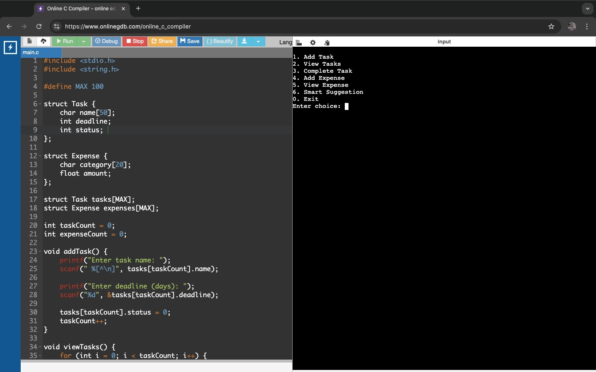
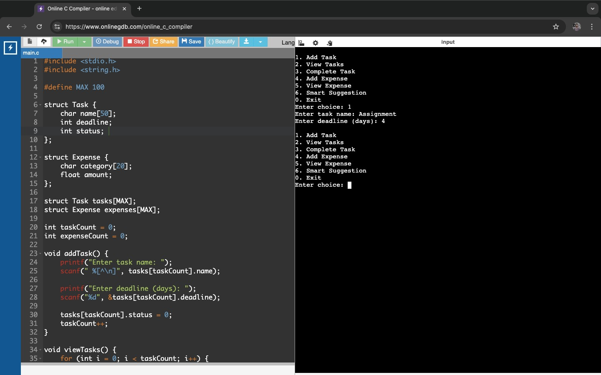
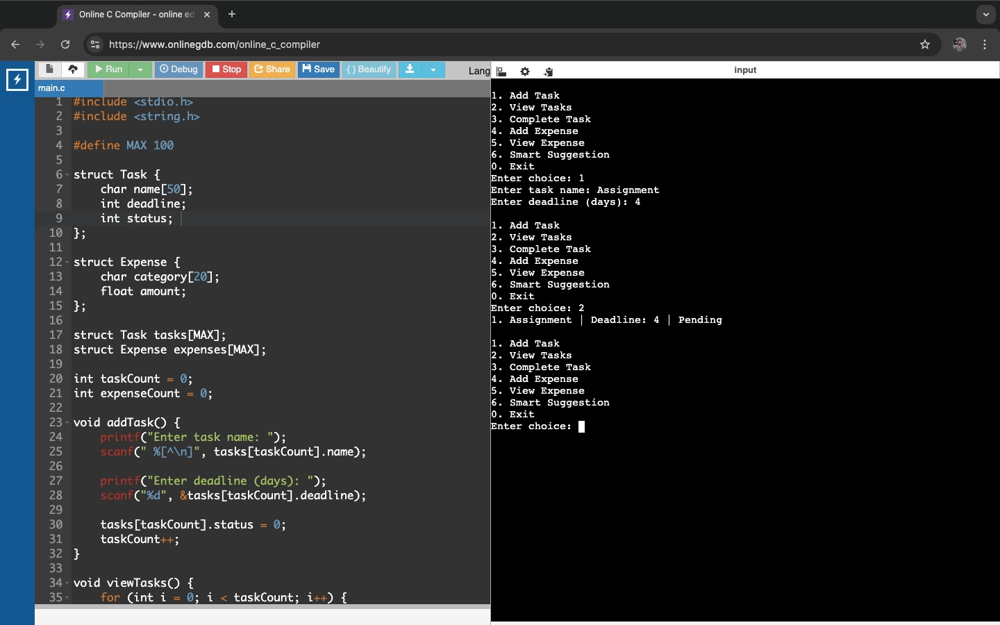
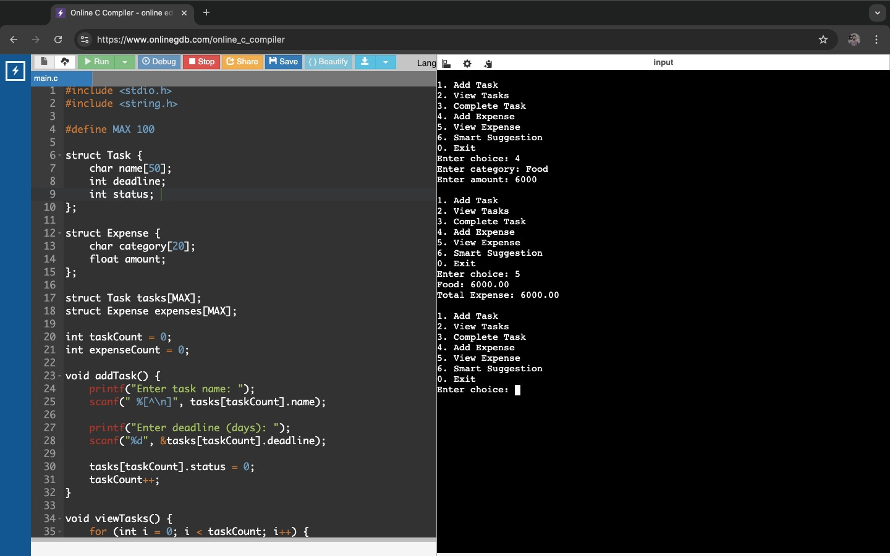
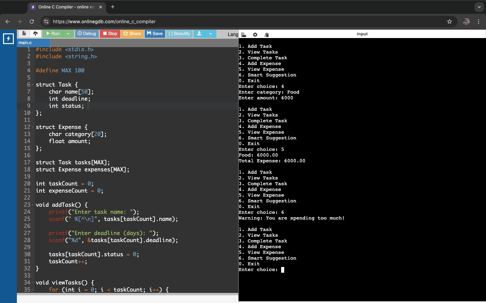

## Student Productivity & Expense Manager (C)

## Project Overview
This is a console-based application developed using the C programming language. It helps students manage their daily tasks and track expenses efficiently. The system also provides simple alerts based on user activity.

##  Features
- Add and manage daily tasks  
- Track daily expenses  
- Calculate total expenses  
- Show task list  
- Generate system alerts  

## Technologies Used
- C Programming  
- Console Application  

##  Project Screenshots

### Sample Output of Student Productivity & Expense Manager

### Adding a New Task

### View Task

###  Add and View Expense

###  System Alert Output

## Learning Integration
This project is developed based on concepts learned from:
- Google Project Management  
- Google Data Analytics  
- IBM Software Engineering  
- Stanford AI Awakening  

##  How to Run

1. Compile the program:
gcc project.c -o project

2. Run the program:
./project

## Author
Md Tasnimul Islam Shad 

##  Conclusion
This project demonstrates how C programming can be used to solve real-life problems like task management and expense tracking in a simple and efficient way.
